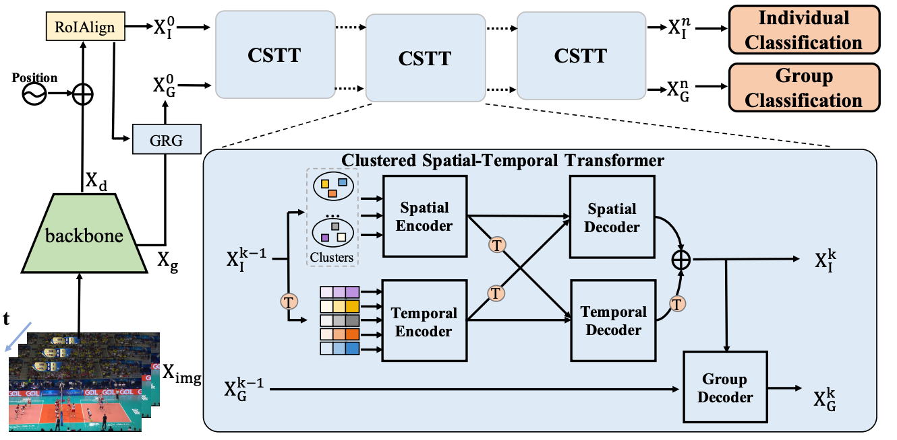

# GroupFormer
By Shuaicheng Li, Qianggang Cao, Lingbo Liu, Kunlin Yang, Shinan Liu, Jun Hou, Shuai Yi.
This repository is an official implementation of the paper 
[Group Activity Recognition with Clustered Spatial-TemporalTransformer](https://arxiv.org/abs/2108.12630)

## Introduction
GroupFormer utilizes a tailor-modified Transformer to model individual and group representation
for group activity recognition. Firstly, we develop a Group Representation Generator to generate an initial group representation by merging the individual context and scene-wide
context. Multiple stacked Spatial-Temporal Transformers(STTR) are then deployed to augment and refine both the individual and group representation. It takes advantage of query-key mechanism to model spatial-temporal context jointly for group activity inferring.


## License

This project is released under the [Apache 2.0 license](./LICENSE).

## Results

|    Backbone     |  Style | Action Acc | Activity Acc|  Config | Download      |
| :-------------: | :-----: | :-----: | :------: | :------: | :-----------: |
|   Inv3+flow+pose   |  pytorch  |   0.847 |  0.957  |  [config](https://github.com/xueyee/GroupFormer/blob/main/config/cluster_tr/inv3_cluster_sttr_global_v3_flip_w3_v4_cat2.yaml) | [model](https://drive.google.com/file/d/1vcmdfZRvIfmkZtkfnP-8CHvzYMT4BxaH/view?usp=sharing) &#124; [test_log]( https://drive.google.com/file/d/1Y8e_yd8ObZuaY1Vp1rhrlx0FFSsD_dz7/view?usp=sharing)

##Preparation
### Requirements
* Linux, CUDA>=9.2, GCC>=5.4
  
* Python>=3.7
### Compiling RoIAlign

## Usage
### Dataset and Exatrcted features

First download the [Volleyball dataset](https://github.com/mostafa-saad/deep-activity-rec#dataset).

The following file need to be adapted in order to run the code on your own machine:
- Change the file path including `keypoint, dataset,tracks and flow`  in `config/*.yaml`.

We also provide the [Keypoint data](https://drive.google.com/file/d/19RUQ91vBlS2b9P1FfieJvr91zcEVxK1e/view?usp=sharing) extracted from [AlphaPose](https://www.mvig.org/research/alphapose.html).
  
Flow data is too huge to upload, it can be easily generated by [flownet](https://github.com/NVIDIA/flownet2-pytorch) as mentioned in our paper.

### Training
```bash
./dist_train.sh $GPU_NUM $CONFIG
```
###  Testing 
```bash
./dist_test.sh $GPU_NUM $CONFIG $CHECKPOINT 
```

## Citing GroupFormer
If you find this work is useful in your research, please consider citing:
```bibtex
@inproceedings{li2021groupformer,
  title={GroupFormer: Group Activity Recognition with Clustered Spatial-Temporal Transformer},
  author={Li, Shuaicheng and Cao, Qianggang and Liu, Lingbo and Yang, Kunlin and Liu, Shinan and Hou, Jun and Yi, Shuai},
  booktitle={Proceedings of the IEEE/CVF International Conference on Computer Vision},
  pages={13668--13677},
  year={2021}
}
```


## More Info
A humble version has been released, containing core modules mentioned in this paper.

Any suggestion are welcome. We are glad to optimize our code and provide more details.

